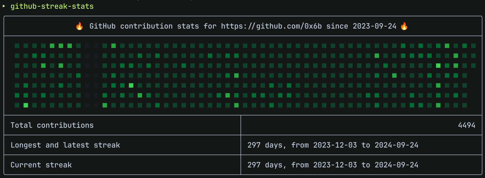

# github-streak-stats

Simple CLI to show GitHub contribution streak for specified user.

## Installation

```
$ cargo install --git https://github.com/0x6b/github-streak-stats github-streak-stats-cli
```

## Setup

Export your GitHub personal access token as
`GITHUB_TOKEN` environment variable, or pass it as an argument
`--github-token. The token should have `read:user` scope.

## Usage

```console
$ github-streak-stats
```


See help for detail.

```
$ github-streak-stats -h
Show GitHub contribution streak. Export `GITHUB_TOKEN` environment variable
with your GitHub personal access token which has `read:user` scope.

Usage: github-streak-stats [OPTIONS] --github-token <GITHUB_TOKEN> [LOGIN]

Arguments:
  [LOGIN]  GitHub login name. Defaults to the login name of the GitHub API
           token owner

Options:
  -g, --github-token <GITHUB_TOKEN>
          GitHub personal access token [env: GITHUB_TOKEN=ghp_...]
  -f, --from <FROM>
          Start date, in YYYY-MM-DD format. Default value will be the first
          Sunday before 52 weeks ago. If specified, it will be the first
          Sunday before the specified date
  -t, --to <TO>
          End date, in YYYY-MM-DD format. Please note that the total time
          spanned by 'from' and 'to' must not exceed 1 year. Default value
          will be the first Saturday after today. If specified, it will be
          the first Saturday after the specified date
  -o, --offset <OFFSET>
          Offset from UTC, in (+|-)HHMM format [default: +0900]
  -r, --display-public-repositories
          Display number of public repositories owned
  -m, --no-display-matrix
          Do not display contribution matrix
  -e, --theme <THEME>
          Theme for the contribution matrix. Possible values: dark, light,
          or auto [default: auto]
  -h, --help
          Print help
  -V, --version
          Print version
```

## License

MIT. See [LICENSE](LICENSE) for details.

## Reference

- [Creating a personal access token - GitHub Docs](https://docs.github.com/en/authentication/keeping-your-account-and-data-secure/creating-a-personal-access-token)
